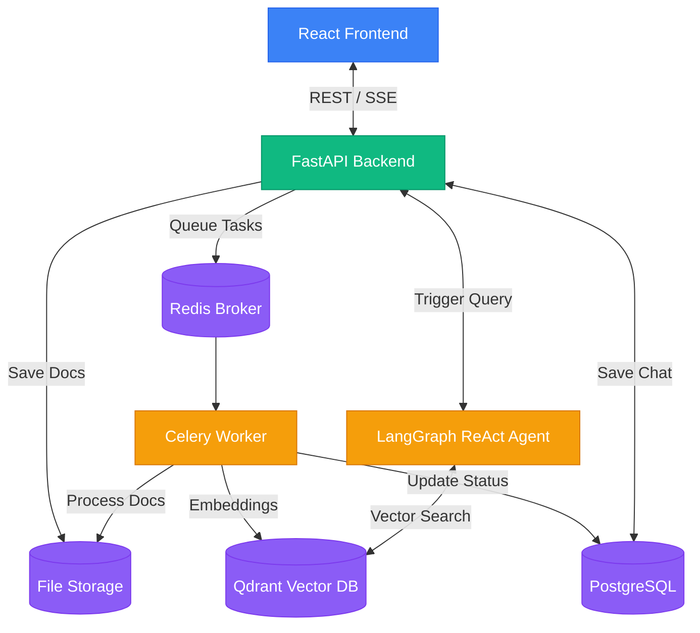

# Comprehensive Codebase Analysis

## 1. Project Overview
The Personal Document Chatbot is a multi-tenant, production-ready system that allows users to upload documents (PDFs, Images, Excel, CSV, Word, PPT), processes them into vector embeddings, and provides a conversational interface powered by a LangGraph ReAct agent to search and query the documents.

## 2. Tech Stack

### Frontend
- **Framework:** React 19 (TypeScript), bundled with Vite.
- **Styling:** Tailwind CSS, Framer Motion for animations.
- **State Management:** Zustand, React Router DOM v7.
- **Rendering:** React Markdown for rendering AI responses with rich formatting.

### Backend
- **Core Framework:** FastAPI (Python), Uvicorn.
- **Database:** PostgreSQL 15 (SQLAlchemy 2.0 with asyncpg) for users, chat history, and document metadata.
- **Vector Store:** Qdrant for storing vector embeddings and enabling hybrid semantic search.
- **Background Jobs:** Celery and Redis 7 (broker) for heavy document processing.
- **AI & ML:** LangGraph (Agent orchestration), Google Gemini 3 (LLM, Vision, Embeddings), Qwen-VL (Vision-Language model for tables/images).

## 3. High-Level Architecture & Component Map

The architecture follows a modular, microservice-like approach orchestrated via Docker Compose.



## 4. Detailed Data Flows

### A. Document Upload & Processing Pipeline
When a user uploads a document, the heavy lifting is offloaded to background workers to prevent blocking the API.

1. **Upload:** User uploads a file via the frontend to `/api/documents/upload`.
2. **Storage:** FastAPI saves the raw file to Google Cloud Storage (or local fallback).
3. **Queueing:** A task is dispatched to the Celery worker queue via Redis.
4. **Extraction (`app/document_processing/extractor.py`):**
   - **Text Docs:** Extracted using Unstructured.
   - **Spreadsheets:** Parsed with `openpyxl`/`csv` directly into Markdown tables.
   - **Scanned PDFs/Images:** Fallback to PyMuPDF and VLM (Qwen-VL or Gemini) to extract text, tables, and captions.
5. **Chunking (`app/document_processing/chunker.py`):** The extracted text and markdown tables are chunked intelligently, ensuring tables are not split mid-row.
6. **Embedding (`app/document_processing/embeddings.py`):** Text chunks are passed through the embedding model (Gemini) to generate 3072-dimensional vector representations.
7. **Indexing:** Vectors and payload metadata (e.g., `element_type: "table"`) are upserted into Qdrant.
8. **Completion:** PostgreSQL is updated to mark the document processing as `COMPLETED`.

### B. Chat & ReAct Agent Flow
The chat functionality is driven by an autonomous LangGraph agent (`app/agent/graph.py`) that decides when and how to search the knowledge base.

1. **User Query:** User sends a question (potentially with ad-hoc image attachments) to `/api/chat/stream`.
2. **Pre-processing:** If ad-hoc images are attached, they are quickly processed and stored as JSONB metadata in PostgreSQL.
3. **Decompose Query:** A fast LLM call checks if the query is complex. If so, it decomposes the intent into a step-by-step plan.
4. **Action Router (ReAct Loop):** 
   - The LLM assesses the query and the current context.
   - **Needs Info?** It triggers a Tool (e.g., `search_documents`, `query_spreadsheet`, `calculator`).
   - **Tool Execution:** The backend queries Qdrant (hybrid search: vector + BM25) or uses Pandas to query spreadsheets. Results are fed back to the LLM.
5. **Self-Reflection:** Before answering the user, the agent reflects on whether the gathered info is `ADEQUATE` or `INCOMPLETE`. If incomplete, it goes back to search more.
6. **Streaming:** Once an adequate answer is drafted, the response is streamed back to the frontend via Server-Sent Events (SSE).

### C. Agent Roles and Capabilities (LangGraph Nodes)
The single ReAct agent operates through a cycle of four specific nodes:
1. **Decompose Agent (`_decompose_query`):** A fast LLM planner that breaks complex queries into numbered step-by-step plans.
2. **Main ReAct Agent (`_call_model`):** The core reasoner that evaluates the query and context, and either issues tool calls or generates a final response. It has access to tools like `search_documents`, `compare_documents`, `query_spreadsheet`, `calculator`, and `date_calculator`.
3. **Tool Execution Node (`ToolNode`):** Automatically executes the tools requested by the Main Agent (e.g., querying Qdrant or running Pandas calculations) and returns factual results.
4. **Reflection Agent (`_reflect_on_answer`):** An independent QA evaluator that grades the Main Agent's draft answer as `ADEQUATE`, `INCOMPLETE`, or `NO_DATA`. An incomplete grade forces the agent to loop back and search more.

## 5. Directory Structure & Key Modules

- `backend/app/main.py`: Entry point for FastAPI, handles routing and database initialization.
- `backend/app/agent/graph.py`: LangGraph implementation containing the nodes for decompose, tool calling, and reflection.
- `backend/app/agent/tools.py`: Contains the actual functions the LLM can invoke (Qdrant search, summarization).
- `backend/app/document_processing/`: Core pipeline for turning files into chunks and embeddings.
- `backend/app/worker.py`: The Celery task definition that ties the processing pipeline together.
- `backend/app/websockets.py`: Real-time notifications for document processing statuses.
- `frontend/src/components/chat/`: Chat UI components, handling SSE streams and markdown rendering.

## 6. Setup and Deployment Steps

### Prerequisites
- Docker and Docker Compose
- Node.js & npm (for local frontend dev)
- Python 3.12+ (for local backend dev)
- Google API Key (for Gemini)

### Step 1: Environment Configuration
1. Copy `.env.example` to `.env` in the root directory.
2. Provide your `GOOGLE_API_KEY` and define your database credentials. Make sure `DATABASE_URL` uses the `postgresql+asyncpg://` scheme.

### Step 2: Running via Docker (Recommended)
This spins up Postgres, Qdrant, Redis, the backend, the Celery worker, and the frontend.
```bash
docker-compose up -d --build
```
- **Frontend:** http://localhost:3000
- **API Docs:** http://localhost:8000/docs
- **Qdrant DB:** http://localhost:6333

### Step 3: Local Development (Without Docker)

**Backend:**
```bash
cd backend
python -m venv venv
source venv/bin/activate
pip install -r requirements.txt
uvicorn app.main:app --reload
# In another terminal, start the worker:
celery -A app.celery_app worker --loglevel=info
```

**Frontend:**
```bash
cd frontend
npm install
npm run dev
```

## 7. Current Work / Roadmap Features (From `task.todo`)
- **Attachments Processing:** Improving ad-hoc image attachments flow so they are parsed into temporary RAG instead of being passed raw to Gemini repeatedly.
- **VLM Pipeline Optimization:** Ensuring Qwen-VL/Gemini accurately process images/tables without duplicating content during retry loops.
- **Production Storage:** Switching from local JSONB inline base64 images to Google Cloud Storage blobs for attachments in production.
- **Search Enhancements:** Moving towards more advanced vector indexing and hybrid search tuning.
